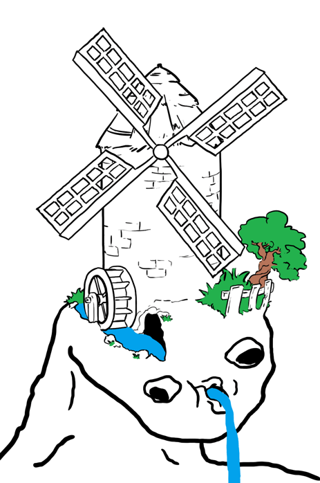

# hello
**im charles**

and this is my website

As you can see, the tone of this site is very nonserious, so to any hiring managers reading please dont judge me too harshly.

[this is my LinkedIn](https://www.linkedin.com/in/charlesj-young/)

[and heres my resume](CharlesYoungResume.pdf)

[jump to the stuff im working on here (pysch theres nothing rn but i need this for the 110 credit gotem)](#other-cool-stuff)

## about me
i'm a 21 yo gamer git pulling myself out of the holes i dig. i get my rush through competitive play and achievement hunting. Right now im trying to complete

- Rimworld
- Shotgun King
- Rebuild 3

i dont have a lot of coding skills and im no Leetking (at least not until i start applying to jobs again lmao), but im decent at presenting and planning and have a pretty solid understanding of math and stats. my interests professionally highest first are 

1. Metaheuristics (evolutionary strategy, genetic algorithms)
2. Deep learning
3. Data mining/web crawling

right now my long term to-do list is:

- [ ] finish cse 110
- [ ] graduate
- [ ] sell my soul to a defence contractor (haha jk... unless?)

## Other cool stuff

ill put some more stuff here later (when i have cool stuff to show)